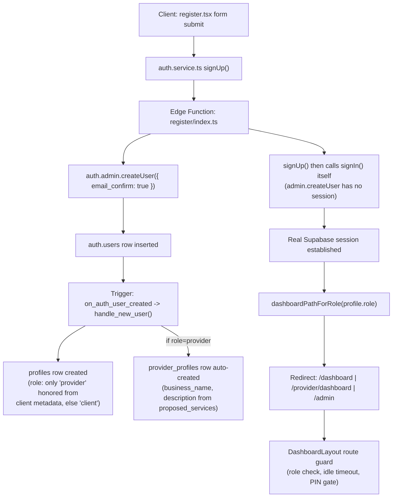
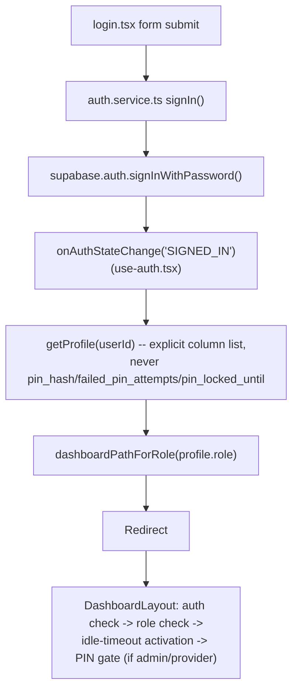
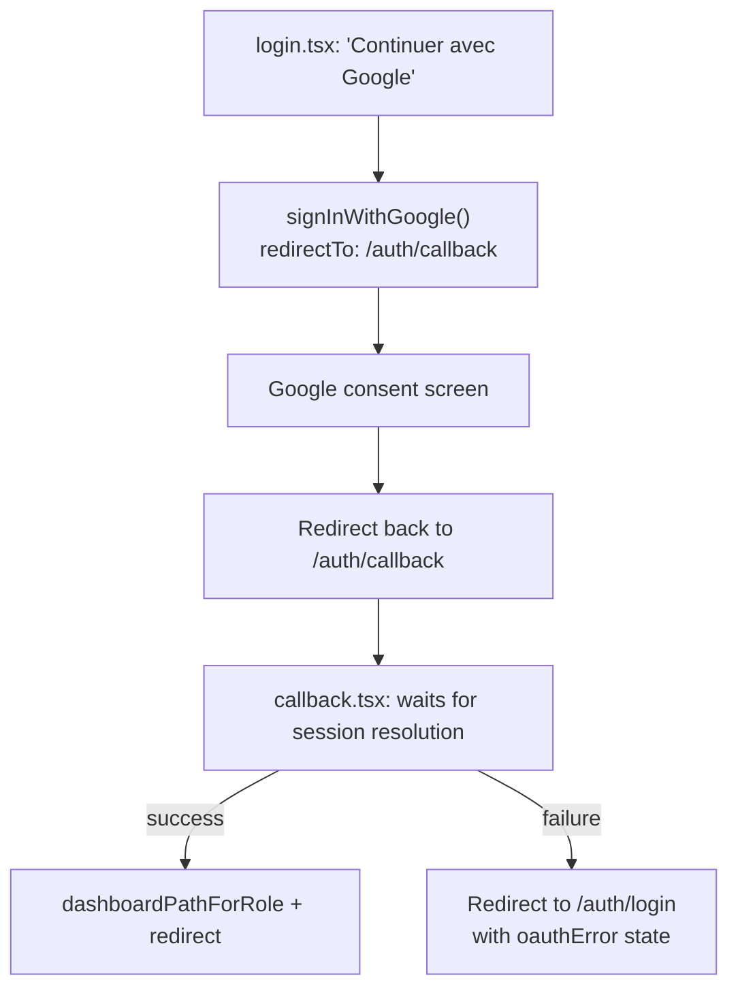

# COIN-IDEAL Authentication Architecture

## Registration → role → dashboard flow (EXISTING)

Source: `src/pages/auth/register.tsx`,
`src/features/auth/services/auth.service.ts`,
`supabase/functions/register/index.ts`,
`supabase/migrations/00003_create_profiles.sql` (trigger),
`00054_fix_signup_role_metadata.sql` +
`00057_provider_signup_extras.sql` (trigger's final body),
`src/features/auth/utils/dashboard-path.ts`.

**Why signup goes through an Edge Function instead of `supabase.auth.signUp()`
directly**: the project's default email-confirmation rate limit (2/hour) was
being exhausted by normal testing/use, returning `429
over_email_send_rate_limit` on every subsequent signup attempt. Rather than
change the project's global Auth config (risky — `config.toml`'s
`site_url`/redirect settings are misaligned placeholders that would break
OAuth if pushed), `register/index.ts` uses the Admin API's
`email_confirm: true` option to skip the confirmation email path entirely
for normal signups. See `docs/architecture/DECISIONS.md`.

**Role trust boundary**: `role` in signup metadata is **client-controlled**
(anyone can send `{"role": "admin"}` in the request body). `handle_new_user()`'s
`CASE WHEN raw_user_meta_data ->> 'role' = 'provider' THEN 'provider' ELSE
'client' END` is the only place this is decided, and it's a strict
whitelist — any value other than exactly `'provider'` (including `'admin'`
or garbage) silently becomes `'client'`. **No signup path can ever create an
admin.** Admin accounts are created by direct one-time migration
(`00038_promote_real_account_to_admin.sql`), never through the public API.

## Login flow

Source: `src/pages/auth/login.tsx`,
`src/features/auth/hooks/use-auth.tsx`,
`src/features/auth/services/auth.service.ts`.

## Google OAuth flow

Source: `src/pages/auth/callback.tsx`,
`src/features/auth/services/auth.service.ts`.

**Root cause of the previously-reported "404 after Google login"**:
`signInWithGoogle()` redirected to `/auth/callback`, but that route did not
exist in `src/app/router.tsx` — React Router fell back to its generic 404
while the Supabase session was actually establishing correctly in the
background. Fixed by adding the `/auth/callback` route and page (see
`docs/phase-5/BATCH_FIX_ADMIN_ROLES_CHAT_REPORT.md`) — a frontend routing
gap, not an OAuth configuration problem.

## Session mechanics — three distinct concepts, not to be confused

| Concept | Lifetime | Enforced by | Notes |
|---|---|---|---|
| **Access token (JWT)** | `jwt_expiry = 3600` (1h), per `supabase/config.toml` (local value; remote project's actual value not independently re-verified, but supabase-js's behavior is what matters here) | Supabase Auth, silently auto-refreshed by supabase-js (`autoRefreshToken: true`, default) | Expiring alone does **not** end a session from the user's perspective — the client refreshes it transparently. |
| **Refresh token / session** | Long-lived by default, unaffected by this app's code | Supabase Auth | This is why a UI-only "your session expired" message, without an actual `signOut()` call, would be **false** — the underlying session would still be alive and refreshable. |
| **Idle timeout (this app's own feature)** | 1 hour of no mouse/keyboard/touch/pointer activity, admin/provider only | `src/features/auth/hooks/use-idle-timeout.ts`, calling the real `authService.signOut()` on timeout | This is what actually closes the gap above: `signOut()` revokes the refresh token server-side, so the session is genuinely gone, not just hidden. Explicitly **not** applied to the client role (operator's own instruction). |

**PIN elevation** (a fourth, related but distinct concept — see
`docs/architecture/SECURITY_ARCHITECTURE.md`) is a **UX step-up gate**, not
a session mechanism: a `sessionStorage` marker (20-minute lifetime) that
only controls whether `PinGate` re-prompts; it is cleared on `signOut()`
(`clearPinElevationStorage()`, called from `use-auth.tsx`'s `signOut`) so a
second account signing in on the same browser tab never inherits a prior
account's elevated state.

## Role decision points — frontend vs. database

| Where | What it decides | Authoritative? |
|---|---|---|
| `handle_new_user()` trigger | Whether a new signup becomes `client` or `provider` | **Yes** — the only place role is ever set at creation |
| `trg_profiles_role_guard` trigger | Whether a `role` UPDATE is allowed (admin only) | **Yes** — blocks self-promotion even if RLS's row-level `WITH CHECK` would otherwise allow the row to be touched |
| `DashboardLayout`'s `variant`/`profile.role` check | Whether to render `/dashboard`, `/provider/*`, or `/admin/*`'s content, or redirect | **No** — a UX convenience; bypassing it client-side grants no additional data access, because every actual read/write is still RLS/RPC-gated independently |
| `dashboardPathForRole()` | Which URL to redirect to after login/register/OAuth | **No** — pure navigation helper, not a security check |

This distinction — **frontend authorization decides what the UI shows;
database authorization (RLS + triggers + RPCs) decides what data can
actually move** — is the single most important thing to understand before
touching any auth-adjacent code. See
`docs/architecture/ARCHITECTURE_RULES.md` rule 9 and
`docs/architecture/SECURITY_ARCHITECTURE.md`.

## Anonymous

No session, `auth.uid()` is `NULL`. Can read public data (`services_select_active`,
`categories_select_active`, `provider_profiles_select_public`,
`reviews_select_public`, `profiles_select_public` — 4-column-limited),
submit a contact message (`contact_messages_insert_public`), and call
`check_ai_rate_limit()` (the one RPC granted to `anon` — but the
`ai-assistant` Edge Function itself now rejects anonymous callers outright
at the application layer, per the operator's explicit later instruction to
restrict the chat to logged-in users — see
`docs/architecture/DECISIONS.md`).
