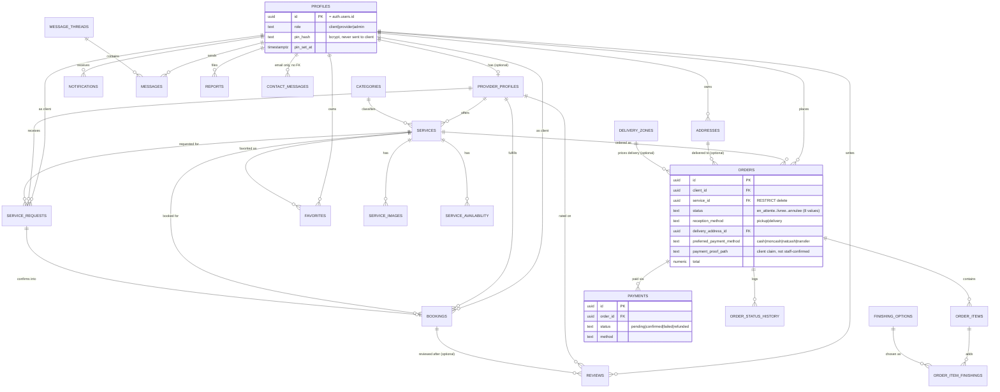

# COIN-IDEAL Database Architecture

**Status**: this document reflects the schema **as of migration `00064`**
(the latest applied to the linked project `qqibjglnvcezqbogkvlg` at time of
writing), built by reading all 64 migration files directly — not by trusting
`docs/database/*.md`, which describe an earlier ("Phase 1") snapshot before
`orders`/`payments` even existed. See `docs/architecture/DECISIONS.md` for
the design rationale those older docs still usefully explain, and
`docs/architecture/ARCHITECTURE_DOCUMENTATION_REPORT.md` for the explicit
source-conflict note.

All 25 tables are under `public`, UUID PKs (`uuid_generate_v4()`) except
`finishing_options`/`settings`/`ai_rate_limits` (TEXT PKs), all RLS-enabled.

## ER Diagram

## Table reference

For each table: purpose, PK, key columns, FKs, who can SELECT/INSERT/
UPDATE/DELETE (RLS, final state), important RPCs/triggers, related frontend
files. `is_admin(uid)`/`is_staff(uid)` are `SECURITY DEFINER STABLE SQL`
helpers (`00021`, `00051`) — see `docs/architecture/SUPABASE_ARCHITECTURE.md`.

### `profiles`
1:1 with `auth.users`. **PK** `id` (= `auth.users.id`). Columns: `email`,
`first_name`, `last_name`, `phone`, `avatar_url`, `bio`, `role` (`CHECK IN
('client','provider','admin')`, never widened since `00003`), `pin_hash`,
`pin_set_at`, `failed_pin_attempts`, `pin_locked_until` (`00060`).
**SELECT**: own row (`profiles_select_own`); publicly readable but
column-limited for `anon` (`id, first_name, last_name, avatar_url` only,
via a `GRANT SELECT (...)` narrower than the table, `00048`); admin all
(`profiles_admin_all`, `00027`). **INSERT**: none — only `handle_new_user()`
trigger. **UPDATE**: own row, but `role` changes blocked by
`trg_profiles_role_guard` unless caller is admin (`00027`); admin all.
**DELETE**: none via RLS (only `auth.admin.deleteUser()`, which cascades).
Frontend: `src/features/auth/services/auth.service.ts`,
`src/services/admin.service.ts` (`getUsers`).

### `provider_profiles`
Optional business-profile extension. **PK** `id`. **FK** `user_id` →
`profiles` (UNIQUE — one per user). Columns include `business_name`,
`description`, `specialties[]`, `is_verified`, `rating`, `total_reviews`.
**SELECT**: public (`true`). **INSERT**: own (`user_id = auth.uid()`) — in
practice created automatically by `handle_new_user()` at signup, not
manually. **UPDATE**: own; admin all (`provider_profiles_admin_all`,
`00059` — before this, the admin "Vérifier ce prestataire" button silently
affected 0 rows). Frontend: `src/pages/provider/profile.tsx`,
`src/pages/admin/providers.tsx`.

### `categories`
**PK** `id`, `slug` UNIQUE, `is_active`. **SELECT**: active-only public;
admin all (`categories_admin_all`, logic **fixed in `00051`** — see
`docs/architecture/DECISIONS.md` for why the original inline check broke).
**INSERT/UPDATE**: admin only, via `src/pages/admin/categories.tsx`'s
own local hooks (no shared `categories` write service exists). No
DELETE policy — categories are deactivated, never deleted.

### `services`
Catalogue items; **price lives here**. **PK** `id`. **FK** `provider_id` →
`provider_profiles`, `category_id` → `categories`. UNIQUE
`(provider_id, slug)`. **SELECT** (final, `00058`): public only if
`is_active = true` **and** the owning provider is `is_verified = true`
(`services_select_active`); owner can always see their own
(`services_select_own`); admin all (`services_admin_all`, `00055`).
**INSERT/UPDATE/DELETE**: owning provider only, unless admin (both
`00020`'s owner policies and `00055`'s admin policy exist side by side).
Frontend: `src/services/services.service.ts` (read-only, public),
`src/pages/provider/service-new.tsx`/`service-edit.tsx`,
`src/pages/admin/service-new.tsx` (admin creates on behalf of a chosen
provider — needs `services_admin_all` to bypass the owner check).

### `service_images` / `service_availability`
Both: **PK** `id`, **FK** `service_id` → `services`. Public SELECT; owner
write (join through `provider_profiles.user_id = auth.uid()`); admin all
on `service_images` (`00055`). `service_images` write policy was buggy
until `00042` (see `docs/architecture/DEBUGGING_PLAYBOOK.md` for the exact
symptom/fix, and `is_own_service()` helper).

### `addresses`
**PK** `id`, **FK** `user_id` → `profiles`. Columns:
`label`/`street`/`city`/`state`/`zip_code`/`country` (default `'Haïti'`
since `00024`), `latitude`/`longitude`, `is_default`, `phone` (`00061`).
**SELECT/INSERT/UPDATE/DELETE**: owner only; **plus** `addresses_staff_select`
(`00063`) grants staff (`is_staff()`) read-only access — added because
staff previously had **zero** way to see a client's delivery address when
processing an order, a gap only discovered while testing the Phase 6
order/delivery staff view. Frontend:
`src/services/addresses.service.ts`,
`src/features/document-orders/hooks/use-addresses.ts`,
`src/features/document-orders/components/delivery-options.tsx`.

### `orders` (the transactional core, `00028`+)
**PK** `id`. **FK** `client_id` → `profiles`, `service_id` → `services`
(`ON DELETE RESTRICT` — cannot delete a service with order history),
`delivery_address_id` → `addresses`, `delivery_zone_id` → `delivery_zones`.
`status` CHECK: `en_attente|confirmee|en_preparation|prete|en_livraison|
livree|retiree|annulee` (cahier des charges §5 vocabulary, distinct from
`service_requests`/`bookings`' generic marketplace statuses). `reception_method`
CHECK: `pickup|delivery`. Table CHECK `orders_delivery_address_required`:
delivery requires an address. `preferred_payment_method` (`00030`):
`cash|moncash|natcash|transfer`. `payment_proof_path`/`payment_reference`/
`payment_proof_submitted_at` (`00061`) — the client's unverified claim of
having paid via moncash/natcash. **`INSERT`/`UPDATE`/`DELETE` are `REVOKE`d
from `authenticated`/`anon` outright** (`00028`) — the only writes are
`create_order()`, `update_order_status()`, `submit_payment_proof()`.
**SELECT**: own (client); all (`is_staff()`, fixed `00051`). Frontend:
`src/services/orders.service.ts`, `src/pages/order/document.tsx`,
`src/pages/dashboard/orders.tsx`, `src/features/orders/components/staff-order-card.tsx`.

### `order_items` / `order_item_finishings` / `order_status_history`
Children of `orders`, same SELECT-only-via-staff/own pattern (staff policy
fixed `00051`), no client-writable path — populated only by `create_order()`/
`update_order_status()`. `order_items.unit_price` and
`order_item_finishings.cost` are **snapshots** at order time (price changes
later never rewrite history). `order_items.file_path` points into the
`order-documents` bucket.

### `payments`
**PK** `id`, **FK** `order_id` → `orders`. `method`/`status` CHECKs mirror
`orders.preferred_payment_method`'s value set plus a `status` lifecycle
(`pending|confirmed|failed|refunded`). **No write policy at all** — only
`record_payment()` (staff-only) can insert. This is the **staff-confirmed
ledger**, deliberately kept separate from `orders.payment_proof_*` (the
client's unverified claim) — see `docs/architecture/DECISIONS.md`.

### `finishing_options` / `delivery_zones` / `settings`
Admin-configurable pricing tables (`00028`), direct-write (admin RLS, no
RPC needed — not money-computing paths themselves, just config
`create_order()` reads). `delivery_zones` **exists but has zero rows in
practice** (no real zone list confirmed by the business yet, per `00029`'s
own comment) — `create_order()` falls back to `settings.flat_delivery_fee`
whenever no zone is specified. Frontend: `src/pages/admin/pricing.tsx`.

### `contact_messages`
**PK** `id`. No `client_id` FK — `email`/`name` are free text (anonymous
submitters allowed by design). Length-bounded (`00036`).
`status`/`admin_reply`/`replied_at` (`00056`). **INSERT**: public,
`WITH CHECK (status = 'new')` (anonymous submitters cannot set any other
status). **ALL** (read/reply): staff (`contact_messages_staff_all`, fixed
`00051`). No email-sending integration exists — a reply opens a `mailto:`
link (`docs/phase-5/BATCH_FIX_ADMIN_ROLES_CHAT_REPORT.md`). Frontend:
`src/services/contact.service.ts`, `src/features/contact/hooks/use-contact.ts`,
`src/pages/public/contact.tsx`, `src/pages/admin/messages.tsx`.

### Marketplace-layer tables (kept for future multi-provider use, `00011`–`00019`)
`service_requests` (generic "ask a provider" request, `pending|accepted|
rejected|completed|cancelled`), `bookings` (a confirmed/scheduled instance
of a request, `pending|confirmed|in_progress|completed|cancelled`),
`favorites`, `reviews` (drives `provider_profiles.rating`/`services.rating`
via triggers), `message_threads`/`messages` (peer-to-peer chat, distinct
from `contact_messages`), `notifications` (system-populated only — see
below), `reports`, `admin_logs`. RLS on all of these: owner/participant
scoped for customer actions, provider-owns-the-target for provider actions;
`reports`/`admin_logs` have admin-all (fixed `00051`); the rest have **no
admin-all policy** — admin cannot currently browse an arbitrary user's
addresses/favorites/private messages beyond what customer/provider
policies already expose (a documented, not-yet-decided scope question, see
`docs/architecture/DECISIONS.md`). Two client-side update guard triggers
(`trg_service_requests_client_update_guard`, `trg_bookings_client_update_guard`,
`00027`) restrict a client's own `UPDATE` to exactly "cancel a pending
request/booking", nothing else, as defense-in-depth beyond RLS alone.

### `notifications` — populated automatically, not by any frontend code
No INSERT policy for anyone (by design). Since `00031`, three
`SECURITY DEFINER` triggers write rows automatically:
`notify_order_created` (order placed), `notify_order_status_change` (any
status transition), `notify_payment_recorded` (payment confirmed). No
marketplace-side (`service_requests`/`bookings`/`messages`/`reviews`)
notification is generated — only the `orders` pipeline populates this
table today, despite the `NotificationType` union in `src/types` defining
several other, currently-unused values.

### `ai_rate_limits`
**PK** `rate_key` (TEXT). RLS enabled, **zero policies**, `REVOKE ALL FROM
anon, authenticated` — completely inaccessible except through
`check_ai_rate_limit()`, called by the `ai-assistant` Edge Function.

## Design notes (from `docs/database/DATABASE_SCHEMA.md`, still accurate)

- `order_items.unit_price`/`order_item_finishings.cost` are **snapshots**,
  not live joins — a later tariff change never silently rewrites an
  existing order's recorded price.
- `orders.service_id` uses `ON DELETE RESTRICT`, unlike most FKs in this
  schema (`CASCADE`) — order/financial history must not disappear if a
  service is later deleted; deactivate instead.
- `settings` is a generic key/value table (not one column per setting)
  specifically so new business config doesn't require a migration —
  matches the cahier des charges' "sans changement de code" requirement.

## Traceability

Every table/column/policy/function above was confirmed by direct reading
of `supabase/migrations/00001` through `00064` (see the investigation that
produced this document — full per-migration detail, not summarized from
memory). No relationship is invented.
