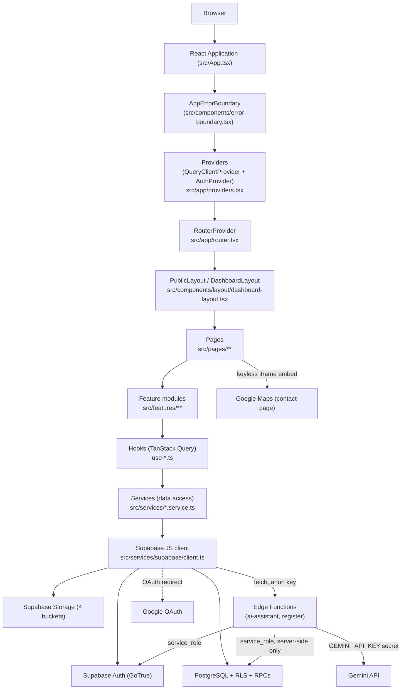

# COIN-IDEAL Project Architecture

> **Classification note**: every statement in this document is **EXISTING**
> (confirmed in code/migrations/config) unless explicitly marked
> **RECOMMENDED**. Source references point to real files.

## 1. Project Overview

**EXISTING.** COIN-IDEAL is a single-business web application for a
print/copy/water-delivery company (impression, copie, vente d'eau) based at
Ruelle Sajous, Gonaïves, Haïti, owned by Guy Petit-Homme
(`src/lib/constants.ts` → `COMPANY`). It lets clients browse services, place
document-printing orders online, pay via MonCash/NatCash (with proof upload)
or in person, choose pickup or delivery, and track order status; it gives
COIN-IDEAL staff (the `provider`/`admin` roles) tools to manage the catalogue,
process orders, record payments, and moderate content; and it includes a
Gemini-powered chat assistant for logged-in visitors.

**EXISTING — architectural note.** The codebase's own schema is shaped like a
generic **multi-provider services marketplace** (`provider_profiles`,
`service_requests`, `bookings`, `reviews`, `message_threads` — one-to-many
providers) because the project was originally built from that template
before being repositioned to the single-business COIN-IDEAL product (see
`docs/database/DATABASE_ARCHITECTURE.md` §1, and Git history: commit
`5018d6c "feat: reposition frontend as COIN-IDEAL"`). **This marketplace
shape was deliberately kept, not removed** — the cahier des charges (§17)
explicitly anticipates COIN-IDEAL becoming multi-provider later. Today, in
practice, there is at most one real `provider_profiles` row (the business
itself) plus the `orders`/`payments` transactional core that was added on
top of this template specifically for the print/copy workflow
(`supabase/migrations/00028` onward). A developer extending this app should
understand both layers exist side by side — see
`docs/architecture/DECISIONS.md` for why.

**Business domains**:
- **Catalogue** — services, categories, provider profiles (marketplace layer).
- **Ordering** — the document print/copy order flow: file upload, print
  options, delivery/pickup, payment mode, order tracking (`orders` core,
  added `00028`+).
- **Marketplace requests** — the generic "ask a provider" flow
  (`service_requests`/`bookings`), a separate, older primitive from before
  the `orders` core existed; still live, still used by the client/provider
  dashboards' "Mes demandes"/"Mes réservations" pages.
- **Contact & support** — public contact form with staff reply
  (`contact_messages`, `00034`/`00056`), and an authenticated-only Gemini
  chat assistant (`supabase/functions/ai-assistant/`).
- **Account security** — Supabase Auth + a 6-digit PIN step-up and 1-hour
  idle timeout for admin/provider accounts (`00060`,
  `src/features/auth/hooks/use-pin.ts`, `use-idle-timeout.ts`).

**Main user roles**: Anonymous, Client, Provider, Admin — see §3 below.

**Technology stack** (from `package.json`, confirmed current versions):

| Layer | Technology |
|---|---|
| Frontend framework | React 19, TypeScript, Vite 8 |
| Styling | Tailwind CSS v4 (CSS-based `@theme` config, no `tailwind.config.js`) |
| Routing | React Router v7 (`createBrowserRouter`, data-router API) |
| Server state | TanStack Query v5 |
| Forms/validation | React Hook Form + Zod |
| Icons | lucide-react |
| Backend | Supabase (Postgres 17, Auth/GoTrue, Storage, Edge Functions on Deno) |
| Deployment | Vercel (frontend), Supabase Cloud (backend), project ref `qqibjglnvcezqbogkvlg` |

Source: `package.json`, `vite.config.ts`, `src/index.css`, `vercel.json`.

## 2. High-Level Architecture

**EXISTING.**

Source: `src/App.tsx`, `src/app/providers.tsx`, `src/app/router.tsx`,
`src/components/layout/dashboard-layout.tsx`, `src/services/supabase/client.ts`,
`supabase/functions/*/index.ts`.

**Key architectural invariant (EXISTING, enforced at the database level, not
just convention)**: the frontend **never** writes directly to `orders`,
`order_items`, or `payments` — those tables have `INSERT`/`UPDATE`/`DELETE`
`REVOKE`d from `authenticated`/`anon` (`00028_create_orders_payments_pricing.sql`).
All writes go through `SECURITY DEFINER` RPCs (`create_order`,
`update_order_status`, `record_payment`, `submit_payment_proof`) that
recompute money server-side. See `docs/architecture/SECURITY_ARCHITECTURE.md`
and `docs/architecture/DATABASE_ARCHITECTURE.md`.

## 3. User Roles

**EXISTING.** Role is a single column, `profiles.role`, `CHECK (role IN
('client', 'provider', 'admin'))` (`00003_create_profiles.sql`, unchanged
since). There is no separate roles/permissions table — role is a flat
enum-like string checked directly in RLS policies (via the `is_admin(uid)` /
`is_staff(uid)` `SECURITY DEFINER` helpers, `00021`/`00051`) and in the
frontend's `DashboardLayout` route guard
(`src/components/layout/dashboard-layout.tsx`).

### Anonymous
- **Accessible areas**: all public routes (`/`, `/services`, `/tarifs`,
  `/comment-ca-marche`, `/vente-eau`, `/commander` up to order submission,
  `/providers`, `/about`, `/contact`, `/auth/login`, `/auth/register`).
- **Workflows**: browse catalogue, read reviews, submit a contact message,
  start (but not submit — requires auth) a document order.
- **Not accessible**: the Gemini chat widget (deliberately gated to
  authenticated users only — see `docs/architecture/DECISIONS.md`), any
  `/dashboard`, `/provider`, `/admin` route (redirected to `/auth/login` by
  `DashboardLayout`).
- **Security boundary**: RLS `SELECT` policies scope anonymous reads to
  `is_active = true` rows only on `services`/`categories`, and (since
  `00058`) additionally require the owning provider to be
  `is_verified = true` for a service to be publicly visible at all.

### Client
- **Default role** on signup (`handle_new_user()`, `00003`, unless `role:
  'provider'` is explicitly requested — `00054`).
- **Dashboard**: `/dashboard/*` (`DashboardLayout variant="client"`).
- **Workflows**: place document orders (`/commander`), track "Mes
  commandes" (`/dashboard/orders`), manage saved delivery addresses, "Mes
  demandes"/"Mes réservations" (marketplace request/booking flow),
  favorites, messaging, notifications, profile settings.
- **Permissions**: full CRUD on their own `addresses`, `favorites`,
  `service_requests`/`bookings` (cancel only, guarded by a trigger from
  `00027`); read-only on their own `orders`/`payments`
  (`orders_select_client`, `payments_select_client`, `00028`); can submit
  payment proof for their own moncash/natcash orders (`submit_payment_proof`,
  `00061`).
- **No idle timeout / no PIN** — explicitly excluded per the operator's
  own instruction (`docs/phase-6/IMPLEMENTATION_PLAN.md` §2).

### Provider
- **Dashboard**: `/provider/*` (`DashboardLayout variant="provider"`).
- **Becomes provider** only via explicit signup choice (`role: 'provider'`
  in signup metadata) — the `register` Edge Function's whitelist rejects
  any other value defaulting to `client` (`supabase/functions/register/index.ts`).
- **Approval gate (EXISTING since `docs/phase-5/PROVIDER_SIGNUP_APPROVAL_REPORT.md`)**:
  a new provider can log in and configure their profile/services
  immediately, but their services are **not publicly visible** on
  `/services` until an admin verifies their account
  (`provider_profiles.is_verified`, gated in `services_select_active`,
  `00058`).
- **Workflows**: manage own services (create/edit, image upload), process
  marketplace requests/bookings, process orders (`/provider/orders` — same
  `StaffOrderCard` component as admin), record payments, view earnings,
  respond to reviews (RLS gap — see `docs/architecture/SECURITY_ARCHITECTURE.md`),
  manage own business profile.
- **Session security**: 1-hour idle timeout (`useIdleTimeout`), 6-digit PIN
  step-up gate before the dashboard renders (`PinGate`,
  `src/pages/auth/pin.tsx`), both wired in `DashboardLayout`.
- **Permissions**: RLS scopes provider access to rows where
  `provider_profiles.user_id = auth.uid()` for services/requests/bookings;
  `orders_select_staff` / `payments_select_staff` (`00028`) and
  `addresses_staff_select` (`00063`) grant **unscoped** read access to
  **all** orders/payments/addresses — documented as an intentional
  "single-staff-pool" MVP simplification (COIN-IDEAL has one real business
  today), not a per-provider-tenant boundary. A future multi-provider
  rollout would need to scope these — see
  `docs/architecture/DECISIONS.md`.

### Admin
- **Dashboard**: `/admin/*` (`DashboardLayout variant="admin"`). An admin
  can also access every `/provider/*` route (`DashboardLayout`'s guard
  allows `profile.role === "admin"` through the provider check too).
- **Workflows**: everything a provider can do, plus: user management
  (`/admin/users`, role suspension), provider verification
  (`/admin/providers`, `verify_pin`-style toggle via `verifyProvider`
  mutation), create a service on behalf of any provider
  (`/admin/services/new`), manage categories, manage pricing/finishing
  options/delivery zones/settings (`/admin/pricing`), reply to contact
  messages (`/admin/messages`), moderate reviews.
- **Session security**: same 1-hour idle timeout + PIN step-up as provider.
- **Permissions**: `is_admin(auth.uid())`-gated `*_admin_all` RLS policies
  exist on `profiles`, `provider_profiles`, `services`, `service_images`,
  `categories`, `reports`, `delivery_zones` — **not** on every table (see
  `docs/architecture/SECURITY_ARCHITECTURE.md` for the exact list of tables
  still lacking an explicit admin-all policy, relying instead on the
  broader staff-read policies).

## Traceability

Every claim above cites a real file or migration inline. No fictional
component or table is referenced. Cross-checked against `docs/database/*.md`
(found stale — see `docs/architecture/DECISIONS.md` and
`docs/architecture/ARCHITECTURE_DOCUMENTATION_REPORT.md` for the "source
conflict" note) and the live migration files, which are authoritative.
