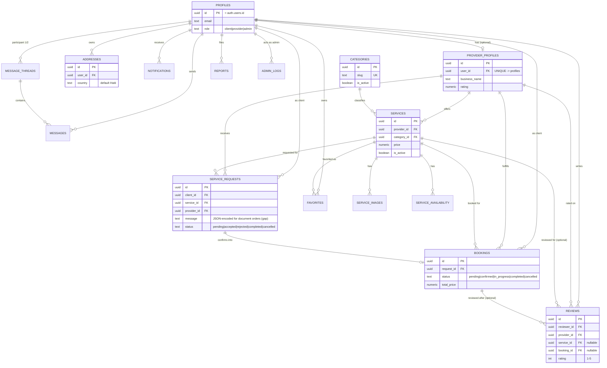
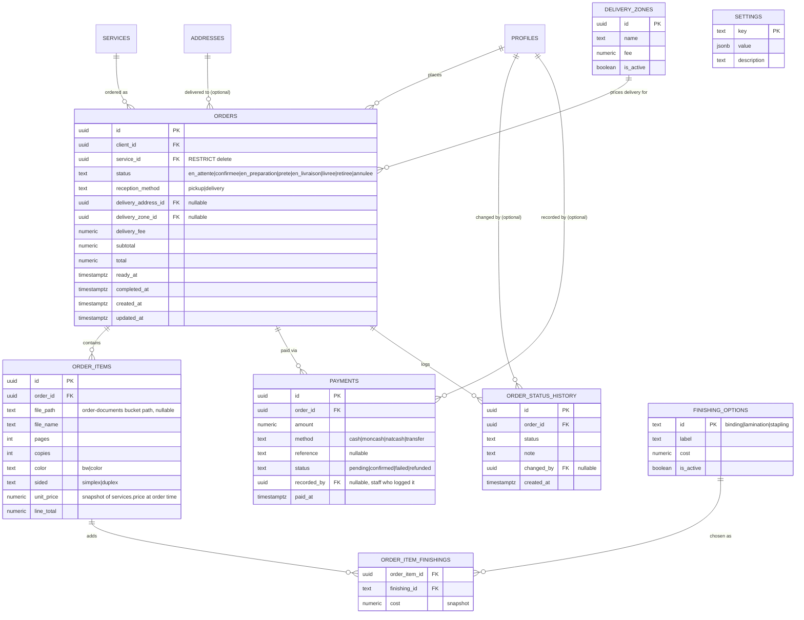

# COIN-IDEAL — Database Schema (ERD)

Two diagrams: (1) what exists today in `supabase/migrations/00001`–`00026`, and
(2) the additive target after the new tables proposed in
`DATABASE_IMPLEMENTATION_PLAN.md` / `supabase/migrations/00027`–`00029`. Nothing in
diagram 2 has been applied — see that plan for phasing.

## 1. Existing schema (as implemented)

**No `payments`, `orders`, `order_items`, `deliveries`, `settings` tables exist in this
diagram** — that's the gap documented in `DATABASE_ARCHITECTURE.md` §3.

## 2. Target schema (existing + proposed additions)

Additions only — existing tables/relations from diagram 1 are unchanged and omitted here
for readability except where a new table references them.

### Design notes

- **`order_items.unit_price` and `order_item_finishings.cost` are snapshots**, copied from
  `services.price` / `finishing_options.cost` at order-creation time — so a later tariff
  change never rewrites the price of an already-placed order. This is standard
  order-line-item practice and is what makes server-side recomputation meaningful (compare
  the *snapshot* stored server-side against what the client displayed, not against the
  live, possibly-since-changed tariff).
- **`orders.service_id` uses `ON DELETE RESTRICT`**, not `CASCADE` like most of this
  schema's FKs — you cannot delete a `services` row that has orders against it (unlike
  `service_requests`, which cascades). Financial/order history must not silently
  disappear when a service is deleted; deactivate (`is_active = false`) instead.
- **`settings` is a generic key/value table**, not one column per setting, because the
  cahier des charges explicitly asks for tariffs and delivery config to change "sans
  changement de code" — a typed table would need a migration for every new setting,
  defeating the point. `jsonb value` keeps it queryable while staying schema-flexible.
- **`orders` does not replace `service_requests`/`bookings`.** It is scoped to the
  impression/copie/vente-d'eau transactional flow described in cahier des charges §3–§5,
  using that document's own status vocabulary. Existing marketplace tables are unchanged.
